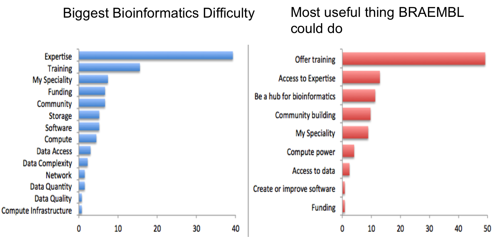

# Universal data literacy powering superior and reproducible research: towards a community of practice

Vision

## {.flexbox .vcenter}

Universal **data literacy** powering superior and reproducible research

What do we mean by data literacy?

## {.flexbox .vcenter}

Universal data literacy powering **superior and reproducible research**

## {.flexbox .vcenter}

**Universal** data literacy powering superior and reproducible research

 &nbsp;
 

[Let's Make Gender Diversity in Data Science a Priority Right from the Start](http://journals.plos.org/plosbiology/article?id=10.1371/journal.pbio.1002206) 
 by Francine D. Berman & Philip E. Bourne

# Data production is no longer the bottleneck

---

# How do we scale data literacy along with data production?

## Training Opportunities

- K-12
- Undergraduate 
- **Active Researchers**

Active researchers are graduate students, postdocs, staff and faculty currently
conducting research. They either have or are generating data for analysis. They have a dataset between them and the question they want to answer. 

## Motivated researchers

[BRAEMBL community survey report](http://braembl.org.au/news/braembl-community-survey-report-2013)

## Training in the Gaps

Active researchers are learning these skills "on the job"

Need to develop and deliver training that fits in their time and attention

Possibilities:

- online self-guided tutorials
- online self-guided short videos
- workshops
- short courses
- one-on-one or small group consulting

No time or focus for semester courses or even MOOCs

Need to develop and deliver training that fits in their time and attention.

## Process of developing & deploying training

(like a drug development process, but hopefully faster)

- Resarch & Development
- Phase 1 trials - small group
- Phase 2 trials - larger group, target audience
- Phase 3 trials? - larger group, with controls
- Approval!
- Phase 4 - broad deployment

- Research & development - determine learning objectives, develop or determine delivery approach and mechanisms, materials development, assessment materials & strategy
- Phase 1 trials - small set of learners for pilots, assess and improve
- Phase 2 trials - larger set of learners from target audience, assess and improve
- Phase 3 trials? - large set of learners, with control groups
- Approval! - determined that training is effective for meeting learning objectives
- Phase 4 - broad deployment, community uptake, continue to track and assess effectiveness; includes operations, programs for sustaining or growing delivery mechanisms

## Case study: Software and Data Carpentry

Research & Development

- Learning objectives: Best practices in software development and data analysis & management
- Delivery approach: intensive, hands-on teaching strategies in 2-day workshops, informed by educational pedagogy
- Delivery mechanism: collaboratively developed lessons available on-line for free use, instructors trained to teach
- Materials development - development of lessons and exercises
- Assessment - assessment surveys for both assessing learning outcomes and improving content

Software Carpentry and Dr. Greg Wilson led much of this R&D

Software Carpentry founded by Greg Wilson in 1998 and then re-booted in 2010

- Identified learning objectives as core skills in software development best practices and data analysis and management best practice, based on needs seen in the community
- Used research in educational pedagogy to develop intensive, hands-on teaching strategies for 2-day workshops; trained some instructors in teaching strategy

## Case study: Software and Data Carpentry

Phase 1 and Phase 2

- Teach workshops to larger numbers of learners, assess outcomes and improve
- Development of an instructor training program to scale delivery
- Development of strategies for lesson improvement and maintenance

## Case study: Software and Data Carpentry

Phase 3 and Phase 4

- Teaching a large number of workshops
- Engaging in assessment, but improving
- Continued scaling challenges, increased need for operations support
- New development
- Community! 

## Case study: Software and Data Carpentry

Community!

An active and engaged community of instructors and learners, both using
and advocating for best practices in effective and reproducible research

How best to support, sustain and grow this community?

Survey question about strongly agree that you would recommend to a friend

## Acknowledgements

- Alfred P. Sloan Foundation
- Gordon and Betty Moore Foundation
- National Science Foundation

## Summary

- Active researchers are very motivated, but need 'on the job' training
- Training for active researchers needs to teach in the gaps
- Different challenges & opportunities in the training process that potentially require different strategies for support and different groups to develop and deliver

## Reproducible presentation

http://tracykteal.github.io/cos-training-presentation/slides.html

https://github.com/tracykteal/cos-training-presentation

